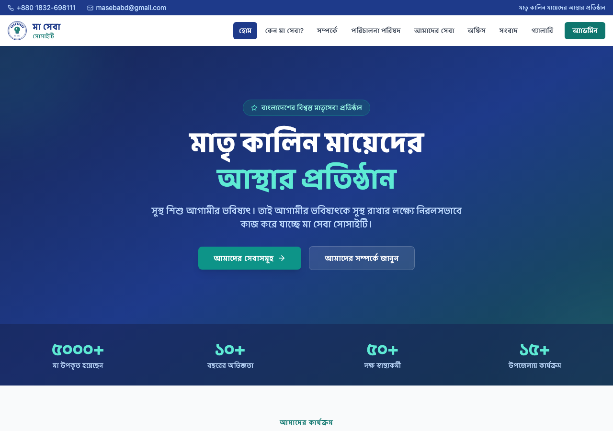
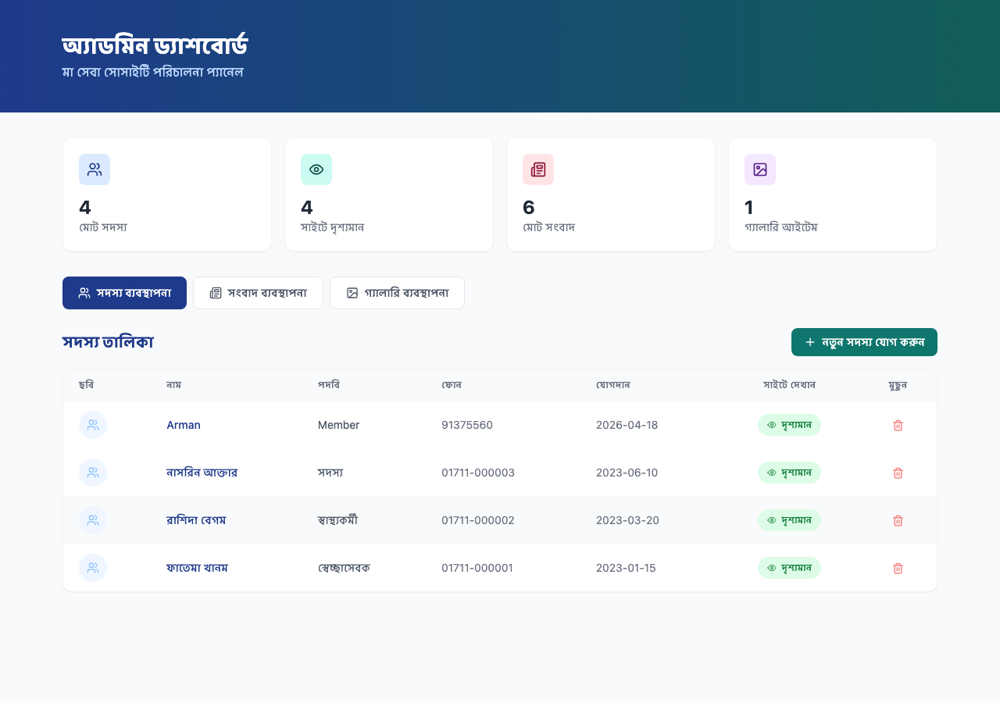
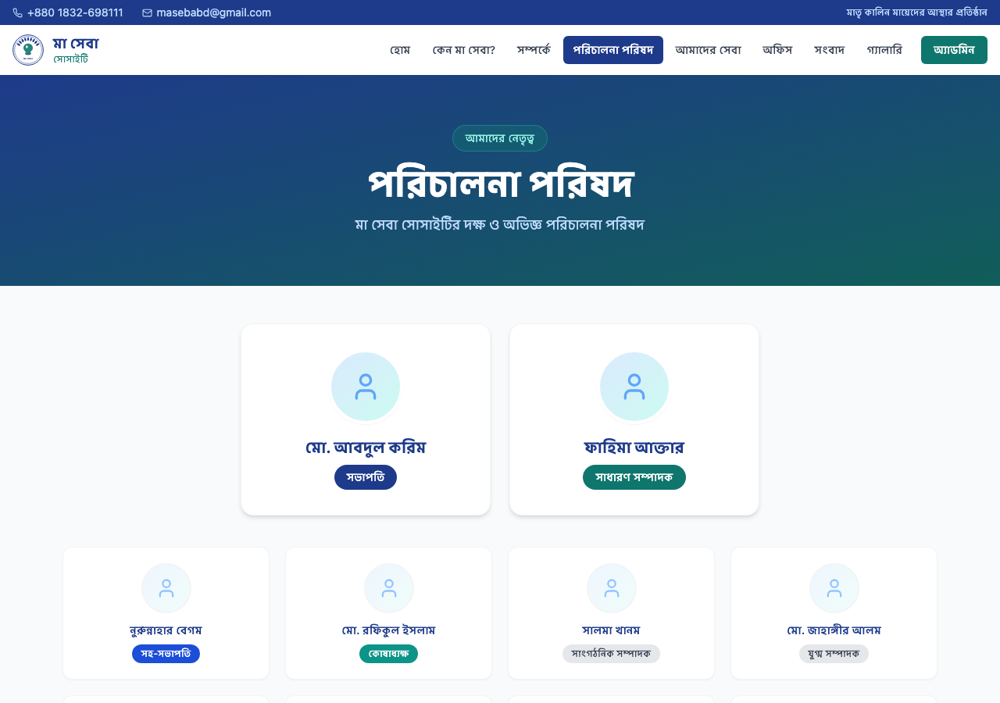
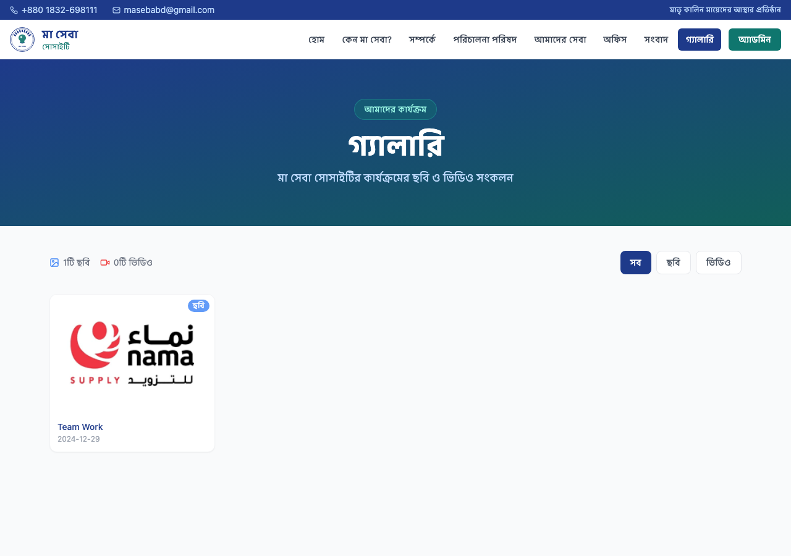

# মা সেবা সোসাইটি — Ma Sheba Society

> **মাতৃ কালিন মায়েদের আস্থার প্রতিষ্ঠান**  
> A trusted maternal health organization based in Feni, Bangladesh.

---

## 🖥️ Live Preview

| Home Page | Admin Dashboard |
|-----------|----------------|
|  |  |

| পরিচালনা পরিষদ | গ্যালারি |
|----------------|---------|
|  |  |

---

## 📋 Project Overview

**Ma Sheba Society** is a full-stack web application for a maternal health NGO in Feni, Bangladesh. It provides a public-facing website with news, board members, member listings, and a media gallery — all managed through a secure admin panel backed by a Django REST API.

---

## ✨ Features

### Public Website
- **Home Page** — Hero section, service overview, latest news
- **About** — Organization history and mission
- **Why Ma Seba?** — Values and impact statistics
- **পরিচালনা পরিষদ (Board)** — Leadership board + regular member listings with photos
- **Services** — Maternal health services offered
- **Office** — Contact and location information
- **সংবাদ (News)** — Dynamic news portal with category filtering
- **গ্যালারি (Gallery)** — Photo & video gallery with lightbox and YouTube embed support

### Admin Panel (`/admin-login` — username: `admin` / password: `maseba2024`)
- Secure token-based authentication
- **সদস্য ব্যবস্থাপনা** — Add/remove members with photo upload, toggle site visibility
- **সংবাদ ব্যবস্থাপনা** — Publish/unpublish news articles
- **গ্যালারি ব্যবস্থাপনা** — Upload images or embed YouTube videos
- Django `/admin/` panel with Bangla labels and full CRUD

---

## 🛠️ Tech Stack

| Layer | Technology |
|-------|-----------|
| Frontend | React 18, TypeScript, Vite, Tailwind CSS |
| Backend | Django 5, Django REST Framework |
| Database | SQLite3 |
| Auth | Token Authentication (DRF) |
| Media | Pillow, Django media serving |
| CORS | django-cors-headers |

---

## 📁 Project Structure

```
Ma-Sheda/
├── Frontend/                       # React + TypeScript frontend
│   ├── src/
│   │   ├── pages/
│   │   │   ├── Home.tsx
│   │   │   ├── Board.tsx           # Leadership + regular members with photos
│   │   │   ├── News.tsx
│   │   │   ├── Gallery.tsx         # Photo & video gallery with lightbox
│   │   │   ├── AdminLogin.tsx
│   │   │   └── AdminDashboard.tsx  # Members, News, Gallery management
│   │   ├── components/
│   │   │   ├── Navbar.tsx
│   │   │   └── Footer.tsx
│   │   ├── api.ts                  # API client (token auth, FormData upload)
│   │   └── types.ts
│   ├── package.json
│   └── vite.config.ts
│
└── backend/                        # Django REST API
    ├── api/
    │   ├── models.py               # BoardMember, Member, NewsItem, GalleryItem
    │   ├── views.py                # ViewSets + token login/logout
    │   ├── serializers.py
    │   ├── urls.py
    │   └── admin.py                # Bangla-labeled Django admin
    ├── backend/
    │   ├── settings.py
    │   └── urls.py
    ├── manage.py
    └── seed_data.py                # Seeds sample board, members & news
```

---

## 🚀 Getting Started

### Prerequisites
- Python 3.10+
- Node.js 18+
- npm

### 1. Clone the repository

```bash
git clone https://github.com/Arman170616/Ma_Sheba.git
cd Ma_Sheba
```

### 2. Backend Setup

```bash
cd backend

# Install dependencies
pip install django djangorestframework django-cors-headers pillow

# Apply migrations
python manage.py migrate

# Create admin user
python manage.py createsuperuser
# OR: pre-configured user is created by seed_data.py (admin / maseba2024)

# Load sample data (board members, members, news)
python manage.py shell -c "
from django.contrib.auth import get_user_model
U = get_user_model()
U.objects.filter(username='admin').exists() or U.objects.create_superuser('admin', 'admin@maseba.org', 'maseba2024')
"
python seed_data.py

# Start server
python manage.py runserver 8000
```

### 3. Frontend Setup

```bash
cd Frontend
npm install
npm run dev
```

### 4. Access the App

| URL | Description |
|-----|-------------|
| `http://localhost:5173` | Public website |
| `http://localhost:5173` → Admin | Admin panel (admin / maseba2024) |
| `http://localhost:8000/admin/` | Django admin panel |
| `http://localhost:8000/api/` | REST API browser |

---

## 🔌 API Endpoints

| Method | Endpoint | Auth | Description |
|--------|----------|------|-------------|
| `POST` | `/api/auth/login/` | Public | Admin login → returns token |
| `POST` | `/api/auth/logout/` | Token | Admin logout |
| `GET` | `/api/news/` | Public | Published news |
| `POST/PATCH/DELETE` | `/api/news/{id}/` | Admin | News CRUD |
| `GET` | `/api/members/` | Public | Visible members |
| `POST/PATCH/DELETE` | `/api/members/{id}/` | Admin | Member CRUD + photo upload |
| `GET` | `/api/board-members/` | Public | Board members |
| `GET` | `/api/gallery/` | Public | Published gallery items |
| `POST/PATCH/DELETE` | `/api/gallery/{id}/` | Admin | Gallery CRUD + image upload |

---

## 🔐 Admin Credentials (Demo)

```
Username: admin
Password: maseba2024
```

> ⚠️ Change these credentials before deploying to production.

---

## 📞 Contact

**মা সেবা সোসাইটি**  
📍 ফেনি, ৩৯০০, বাংলাদেশ  
📞 +880 1832-698111  
📧 masebabd@gmail.com  
🌐 masebabd.com

---

## 📄 License

This project is developed for **Ma Seba Society**. All rights reserved.

---

*Built with ❤️ for the mothers of Bangladesh*
